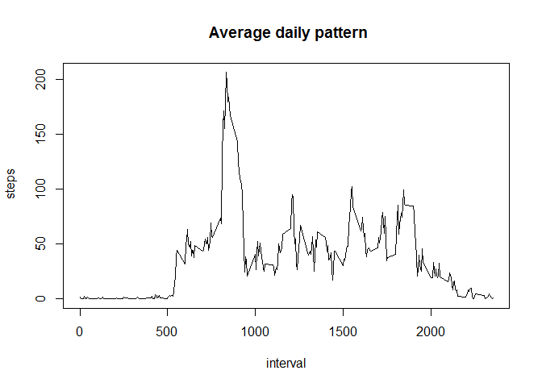
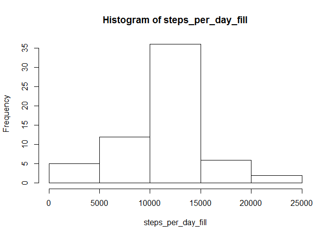
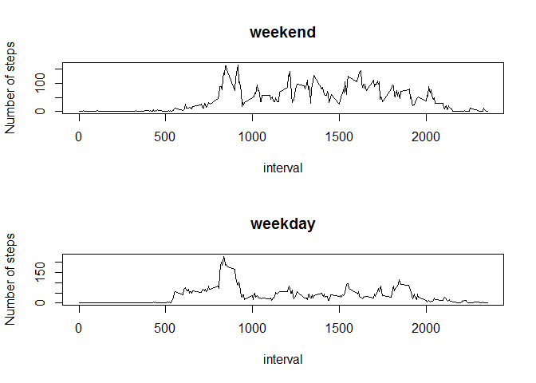

# Reproducible Research: Peer Assessment 1


## Loading and preprocessing the data

```r
data <- read.csv("activity.csv")
```


## What is mean total number of steps taken per day?


```r
steps_per_day <- tapply(data$steps, data$date, sum)
hist(steps_per_day)
```

 

```r
mean_steps <- mean(steps_per_day, na.rm=TRUE)
median_steps <- median(steps_per_day, na.rm=TRUE)
```
The mean total number of steps taken per day is 1.0766189\times 10^{4}.  
the median total number of steps taken per day is 10765.  

## What is the average daily activity pattern?


```r
daily_pattern <- tapply(data$steps, data$interval, mean, na.rm = TRUE)
interval <- as.numeric(names(daily_pattern))
plot(interval, daily_pattern, type = "l",
                              xlab = "interval",
                              ylab = " steps",
                              main = " Average daily pattern")
```

 

```r
max_int <- daily_pattern[grep(max(daily_pattern), daily_pattern)]
```
The maximum number of steps in a day is 206.1698113 and the 5 - minute interval contains that number is 835.

## Imputing missing values


```r
total_nas <- sum(is.na(data))
dat <- data
lng <- length(dat$steps)
for (i in 1:lng)        {
        if (is.na(dat$steps[i]) == TRUE) {
                dat$steps[i] <- daily_pattern[as.character(dat$interval[i])]
        }
}
steps_per_day_fill <- tapply(dat$steps, dat$date, sum)
hist(steps_per_day_fill)
```

 

```r
mean_steps_fill <- mean(steps_per_day_fill)
median_steps_fill <- median(steps_per_day_fill)
```

The new mean of total steps per day is 1.0766189\times 10^{4}. The new median
of total steps per day is 1.0766189\times 10^{4}. Since we replaced the missing value with the mean values, the mean value didn't change. The median is now the mean value and it must have been a replaced NA value.

## Are there differences in activity patterns between weekdays and weekends?


```r
days <- weekdays(as.Date(dat$date, '%Y-%m-%d'))
dat$day <- factor(days=="Sunday" | days=="Saturday")
levels(dat$day)[levels(dat$day) =="TRUE"]<- "weekend"
levels(dat$day)[levels(dat$day) =="FALSE"]<- "weekday"
week_pattern <- tapply(dat$steps, list(dat$day, dat$interval), mean)
```
Here is the graphs for the new data:  


```r
par(mfrow = c(2,1))
plot(interval,week_pattern["weekend",], type = "l",
                        ylab = "Number of steps", main = "weekend")
plot(interval, week_pattern["weekday",],type = "l",
                        ylab = "Number of steps", main = "weekday")
```

 


The graphs shows that activity patterns are different between weekdays and weekends. In weekdays the activities peaked in the morning where in weekends the activities are high throughout the daytime.
